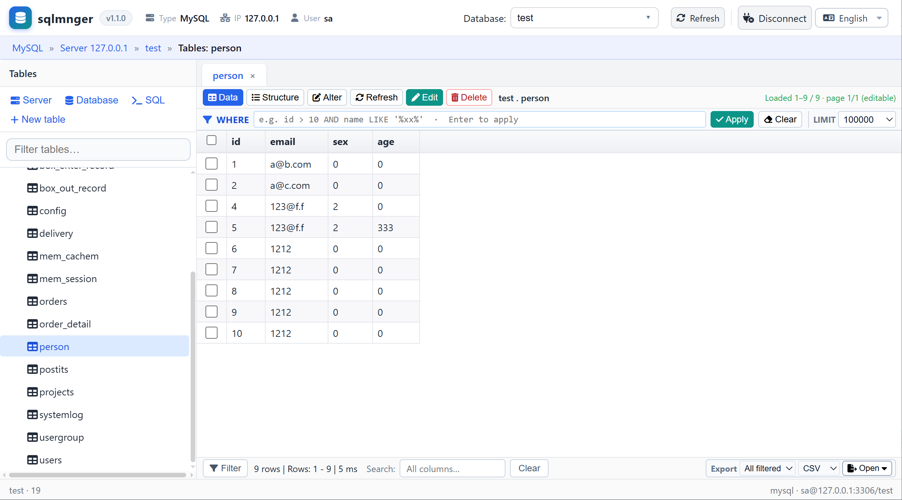

# sqlmnger

Lightweight web database manager (MySQL / SQLite / SQL Server), inspired by Adminer.

**Version**: v1.1.0 · **Status**: runnable prototype / near-MVP

> Chinese: [README.zh.md](README.zh.md) · Changes: [CHANGELOG.md](CHANGELOG.md)



## 1. Features

1. **Three engines, four drivers** — MySQL · SQLite · SQL Server via the usual Microsoft PHP extension **or** a **pure-PHP SQL Server connector** (no extra extension to install).
2. **Zero Composer runtime** — plain PHP **≥ 5.5.12**, drop-in deploy; document root = project root.
3. **SPA + all AJAX JSON** — login, tree, grid, SQL, import/export never full-page postback; credentials stay in a **server Session vault** (not in every request body after login).
4. **Large-table friendly** — load many rows once, **VirtualGrid** paints only the viewport; inline dirty cells, Ctrl+Enter submit, client column filters.
5. **Structure as a draft** — reorder / add / drop columns in the UI, **preview SQL**, apply only **changed** columns (plus adds/drops).
6. **Real multi-connection** — several browser tabs can hold different engines/hosts at once; connection id lives in the URL (`?c=`).
7. **Dump & import in-app** — table export (SQL/CSV/XLSX/JSON) and **database-level** dump/import (SQL/CSV/TSV, gzip SQL) without leaving the page.
8. **Safer SQL console** — multi-statement scripts split in the app; **dangerous SQL** secondary confirm; optional audit log lines under `storage/logs/`.
9. **Lightweight frontend** — plain JS modules, no React / Vue / jQuery / npm build step for the app shell.

### Who it is for

- Local / LAN **ops and debugging** when you want Adminer-class reach with a denser grid and multi-tab connections.
- Hosts where **SQL Server PHP extensions are hard**, but the database server is still reachable (use the pure-PHP SQL Server connector).
- Teams that need a **small, self-contained** web DB tool next to a PHP app — not a full BI suite.

> Capability checklist (screens, APIs, config keys): see **[Feature catalog](#2-feature-catalog)** below.

## 2. Feature catalog

### Connection & navigation

- **Login**: engine / host / user / password (optional empty password via config) → Session with vault-encrypted credentials
- **Saved profiles**: connection list in `localStorage` (optional remembered password is **client obfuscation only**, not encryption)
- **Drivers**
  - MySQL — PDO MySQL
  - SQLite — PDO SQLite (path jailed under `sqlite_root`)
  - SQL Server (extension) — Microsoft PHP SQL Server extension
  - SQL Server (pure PHP) — connection implemented in pure PHP (no Microsoft extension; optional encryption)
- **Multi-tab connections**: connection id in URL `?c=…`
- **Database / table browse**: filterable DB combo + left tree (context menu: data / structure / alter)
- **Hash routing**: restore active table, WHERE, sort, LIMIT, page, and **mode** (`m=struct` / `m=alter`)
- **i18n**: **中文 / English / 日本語 / 한국어** — dropdown on login and main title bar (preference in `localStorage`)

### Table data

- **VirtualGrid**: virtual scroll, dirty cells, submit / Ctrl+Enter, insert / multi-delete, WHERE + LIMIT + paging
- **Edit**: toolbar “Edit”, or **Ctrl+click** (Cmd+click) a cell to enter edit mode
- **Cancel edit**: no confirm dialog; reloads to discard dirty data
- **Checked rows**: highlight selected rows
- **Client filters**: column filter row (bottom **Filter**); closing it clears column filters
- **Full-column search**: status bar, next to row/selection stats
- **Export** (status bar): SQL / CSV / XLSX / JSON — open preview, download, or ZIP; scope page or all filtered

### Structure

- View structure · **Alter table** draft (reorder, add above, drop on apply)
- Type / default **comboboxes** (type-to-filter + match highlight; free text)
- Defaults: quoted strings vs `NULL` / functions
- **Preview SQL** before apply; only **changed** columns emit `ALTER` (plus drops/adds)
- Indexes (immediate write) · create table dialog

### Database import / export

From the **database overview** page (export / import toolbar):

- **Export** (`api/db_export.php`): SQL / CSV / TSV; open / save / ZIP; pick tables (structure / data); DROP+CREATE, AUTO_INCREMENT, triggers, routines, events; data as INSERT / INSERT IGNORE / REPLACE / none
- **Import** (`api/db_import.php`): `.sql` / `.sql.gz` upload (or JSON body); multi-statement execution; stop-on-error; size & statement caps

### SQL console

- **Multi-statement** scripts (app-layer split; batch results; stop on error)
- **Dangerous SQL** secondary confirm (DROP / TRUNCATE / unscoped DELETE·UPDATE, …) when `sql_require_danger_confirm` is true
- **Result export**: SQL / CSV / TSV / JSON — preview, download, ZIP
- Optional default row limit via `default_sql_limit` (`0` = no auto LIMIT)

### Other

- **Server** admin views (privileges / processes / variables / status — best-effort per engine)
- Optional **audit log** (`log_operations` → JSON lines under `storage/logs/`)
- All operations via **AJAX + JSON**

## Requirements

- PHP **5.5.12+** (modern PHP fine)
- Extensions as needed:
  - MySQL: `pdo_mysql`
  - SQLite: `pdo_sqlite`
  - SQL Server (extension path): Microsoft SQL Server PHP extension
  - SQL Server (pure PHP connector): only built-in PHP networking; **openssl** recommended if you enable encryption
- `ZipArchive` for XLSX / multi-file ZIP export
- `gzdecode` for gzip SQL import (optional)

## Quick start

Point the web document root to the **project root** (where `index.php` lives), or:

```bash
php -S 127.0.0.1:8080 -t .
```

Open the URL. After script updates use **Ctrl+F5**.

```text
sqlmnger/
├── index.php              # entry
├── api/                   # JSON APIs
│   └── tds/               # pure-PHP SQL Server connector
├── assets/
│   ├── css/               # app styles
│   ├── js/                # app modules (sqlmnger.*.js)
│   ├── favicon.*
│   └── xui/               # bundled UI assets (tabs, grid, windows, …)
├── config/                # config.php (do not commit secrets)
├── storage/
│   ├── logs/              # audit log (gitignored contents)
│   └── sqlite/            # SQLite jail
└── tmp/                   # local temp (gitignored)
```

> **v1.0.2+**: former `public/` tree is the project root; set the document root to the project root.

## Configuration

```bash
cp config/config.example.php config/config.php
```

| Key | Purpose |
|-----|---------|
| `app_key` | Vault key (≥32 chars); **change in production** |
| `debug` | Expose error detail on login fail |
| `allow_empty_password` | Allow empty DB password (local dev) |
| `session_ttl` | Cookie lifetime (default 7 days) |
| `enabled_drivers` | MySQL / SQLite / SQL Server (extension) / SQL Server (pure PHP) |
| `sqlite_root` | SQLite path jail |
| `default_table_limit` / `default_sql_limit` | Default row limits (`0` = unlimited / no auto LIMIT) |
| `max_fetch_rows` / `unlimited_soft_max` | Caps |
| `sql_require_danger_confirm` | Require confirm for dangerous SQL |
| `log_operations` / `log_path` | Audit JSON log |
| pure-PHP SQL Server encrypt | Encryption mode for the pure-PHP connector: auto / require / disable |
| pure-PHP SQL Server trust cert | Trust server certificate (self-signed LAN) |
| `import_max_bytes` / `import_max_statements` | Import caps (defaults apply if omitted) |
| `sql_exec_max_statements` | Max statements per SQL console submit |

Read via `sqlmnger_cfg('key', $default)`.

**Do not commit real secrets.** Keep `config.example.php` as the public template.

## Language

| Code | Label |
|------|--------|
| `zh` | 中文 |
| `en` | English |
| `ja` | 日本語 |
| `ko` | 한국어 |

Stored as `sqlmnger_lang` in `localStorage`. UI strings live in `assets/js/sqlmnger.i18n.js` (some secondary screens still have partial hard-coded Chinese).

## Hash examples

```text
#v=1&k=t&db=mydb&t=mytable&l=10000
#v=1&k=t&db=mydb&t=mytable&m=struct
#v=1&k=t&db=mydb&t=mytable&m=alter
#v=1&k=sql&db=mydb
#v=1&k=server
```

Table tab titles: table name only when all open tables share one database; `database.table` when multiple DBs are open.

## Main APIs (`api/`)

| Endpoint | Role |
|----------|------|
| `auth_login` / `auth_logout` / `auth_me` | Session; multi-conn via `c` |
| `db_list` / `db_select` / `db_create` / `db_overview` | Databases |
| `db_export` / `db_import` | Database dump / SQL import |
| `table_list` / `table_data` / `table_structure` / `table_export` | Tables & row export |
| `table_row_save` / `table_row_insert` / `table_row_delete` | Row CRUD |
| `table_column` (`apply` / **`preview`**) / `table_index` | Structure DDL |
| `sql_exec` | Run SQL (single or batch) |
| `server_info` / `server_admin` | Server |
| `ping` | Health check |

## Security notes

- Change `app_key`, set `debug` to `false` in production
- Prefer HTTPS and least-privilege DB accounts
- Set `allow_empty_password` to `false` on public hosts
- SQLite paths are jailed under `sqlite_root`
- Saved login passwords in the browser are **obfuscated, not encrypted** — avoid on shared machines
- Pure-PHP SQL Server connector: trusting the server certificate is convenient on LAN; use stricter certificate checks in production
- Keep audit logs and real `config.php` out of public VCS

## Development notes

- App frontend is **IIFE** globals under `assets/js/` (`SqlmngerApp`, `SqlmngerTablePage`, `SqlmngerDbIO`, …) — no bundler required for normal work
- Shared chrome (layout / grid / dialogs) lives under `assets/xui/`; usually leave it alone unless you are extending the shell
- Agent/workspace rules: root `AGENTS.md` (if present)
- One-off scripts and backups go under `tmp/` (gitignored); see `.gitignore`

## License

Internal / project use unless otherwise stated.
